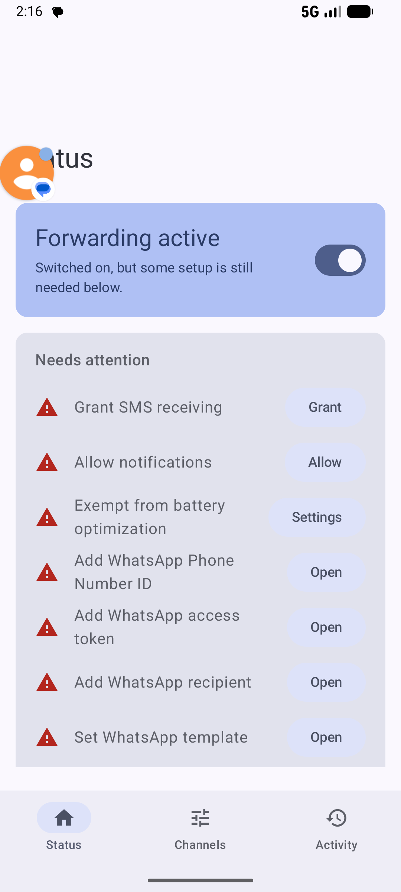
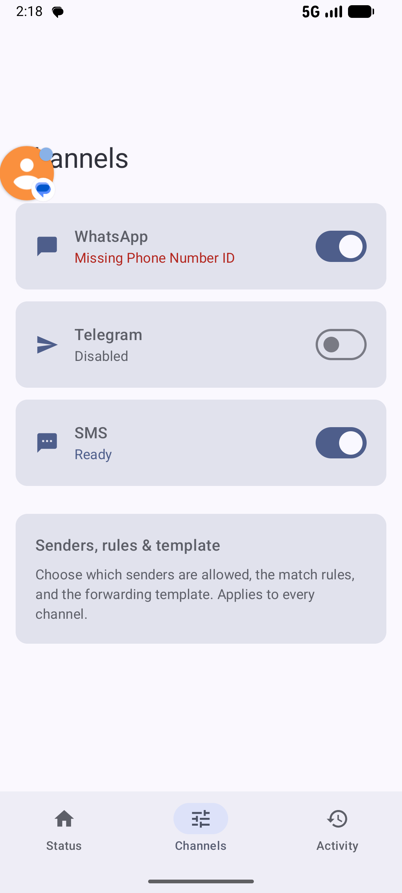
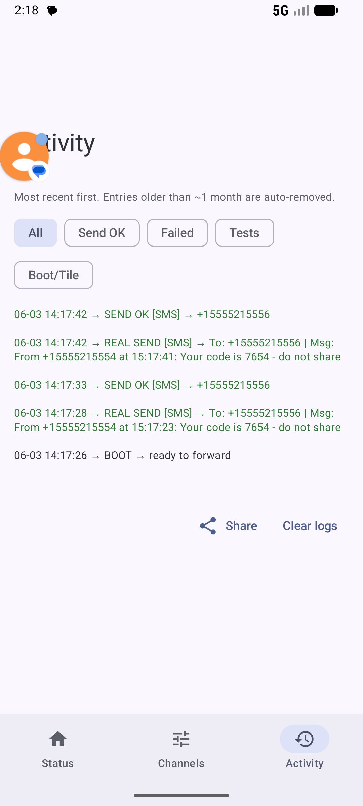
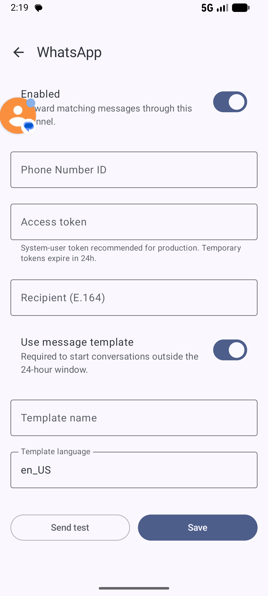
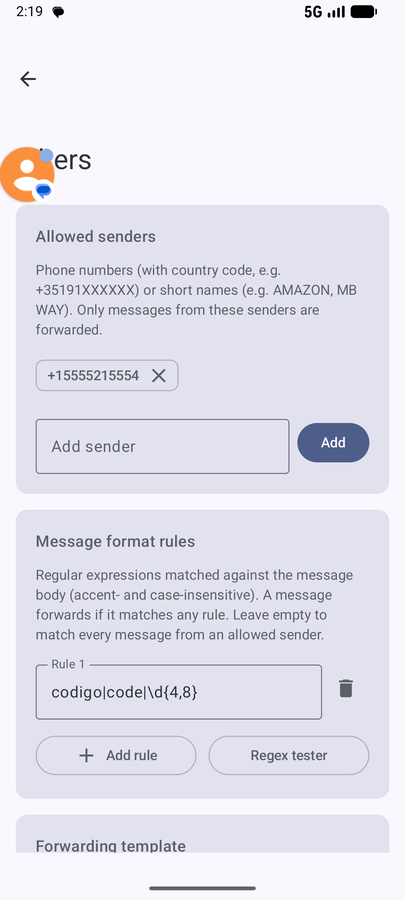

# MC SMS Forwarder (Multi-Channel)

Listens for incoming SMS on an Android device, runs them through a sender/regex filter pipeline, and re-sends the matched body through any combination of three outbound channels:

- **WhatsApp** — via the [WhatsApp Cloud API](https://developers.facebook.com/docs/whatsapp/cloud-api/).
- **Telegram** — via the [Telegram Bot API](https://core.telegram.org/bots/api).
- **SMS** — re-sent from this device's own SIM via `SmsManager`.

Each channel is independently toggleable; enable one, two, or all three at once.

> **Test variant.** The WhatsApp access token and Telegram bot token are stored **encrypted at rest** (Android Keystore-backed `EncryptedSharedPreferences`, separate from the app's plaintext `SharedPreferences`) and are **write-only** in the UI — once saved they are never re-displayed. The SMS channel needs no token — it uses the device modem. Even so, only install on a device you fully control, and use the narrowest credentials you can.

## Screenshots

| Status / readiness | Channels | Activity log |
| --- | --- | --- |
|  |  |  |

The UI is a single-activity Jetpack Compose app with a Material 3 bottom-navigation bar:

- **Status** — a master forwarding switch plus a **readiness checklist** that surfaces only the blocking setup items (permissions, battery exemption, missing credentials) as actionable fix chips, and a lifetime forwarding-stats card.
- **Channels** — WhatsApp, Telegram, and SMS as cards (status + enable switch); tap one to open its detail form, or open **Senders, rules & template** for the shared filters.
- **Activity** — the colour-coded log (green successes, red failures, blue dry-run tests) with filter chips.

| Channel detail (WhatsApp) | Filters |
| --- | --- |
|  |  |

## What it does

- `BroadcastReceiver` listens to `SMS_RECEIVED`.
- Reassembles multipart messages.
- Drops everything unless the **master switch** is on.
- Suppresses any message that arrives from the **SMS forward destination** (loop guard, SMS channel only).
- Matches the sender against the **allowed senders** list (E.164 phone numbers via `PhoneNumberUtils.areSamePhoneNumber`, or case-insensitive exact match for alphanumeric IDs).
- Normalizes the body (NFD + strip combining marks + lowercase) and matches it against **any** of the configured regex patterns.
- Optionally re-formats the outgoing text with a template (`%s` = source, `%t` = time, `%m` = original message).
- Sends the result through **every operational channel** (toggle on AND credentials present):
  - **WhatsApp** — `POST https://graph.facebook.com/v21.0/{PHONE_NUMBER_ID}/messages` with a `Bearer` token, as either a free-form `text` message (inside the customer 24‑hour window) or an **approved template** with the SMS body bound to a single body parameter.
  - **Telegram** — `POST https://api.telegram.org/bot{TOKEN}/sendMessage` with `chat_id` + `text` (web previews disabled).
  - **SMS** — `SmsManager.sendMultipartTextMessage` to the configured destination number; per-segment modem results are surfaced in the activity log.

The reception, filtering, normalization, multipart handling, and template logic are shared by all channels.

## What is NOT included

- No retry / backoff queue. The HTTP channels report 2xx/non-2xx synchronously; the SMS channel reports the modem result asynchronously in the log. Neither retries.
- No webhook server for delivery receipts.
- No media (image/audio/document) forwarding — text only.
- **Loop guard is SMS-only.** A message arriving from the SMS forward destination is suppressed so an SMS→SMS echo cannot bounce indefinitely. WhatsApp and Telegram run on a different transport and cannot re-trigger the pipeline, so they need no guard.

## Build & install

```powershell
.\gradlew.bat :app:assembleDebug          # build debug APK
.\gradlew.bat :app:installDebug           # build + install on connected device/emulator
```

`minSdk` 33, `targetSdk` 36, Kotlin 2.0, AGP 8.13, Jetpack Compose + Material 3.

Release signing is opt-in via Gradle properties (`RELEASE_KEYSTORE_PATH`, `RELEASE_KEYSTORE_PASSWORD`, `RELEASE_KEY_ALIAS`, `RELEASE_KEY_PASSWORD`). No keystore is committed.

## One-time Meta setup (WhatsApp)

The quickest and cheapest path is to use the **test phone number** that Meta provisions for you for free. No credit card, no Business Verification, no template approval cycle. Recipient list is capped at 5 numbers — enough for personal forwarding.

### Click-path: free test number with a never-expiring token

1. Sign in at <https://developers.facebook.com/> and create a **Business** app. From the app dashboard, add the **WhatsApp** product.
2. *WhatsApp → API Setup*: Meta auto-provisions a **WhatsApp Business Account (WABA)** and a **test phone number**. Copy the **Phone number ID** (numeric, under the test number).
3. Still in *API Setup*, under **To**, click **Manage phone number list** and add **your** WhatsApp number as a recipient. Meta will send you a 6-digit verification code on WhatsApp — enter it. You can add up to 5 recipients total.
4. (Optional but recommended) **Send a test message** from the *API Setup* page using the default `hello_world` template, just to confirm the WABA is healthy before generating the long-lived token.
5. Create the long-lived token:
   1. Open **Meta Business Suite** → the gear icon (Business settings) for the business that owns the WABA.
   2. *Users → System users → Add* — give it a name (e.g. `sms-forwarder`) and role **Admin**.
   3. With the new system user selected, click **Add assets** → **Apps** → pick your app → toggle **Full control**. Repeat **Add assets** → **WhatsApp accounts** → pick your WABA → toggle **Full control**.
   4. Click **Generate new token** → pick your app → **Token expiration: Never** → select scopes `whatsapp_business_messaging` and `whatsapp_business_management` → **Generate token** → copy it once (you cannot view it again).
6. In this app, open the **Channels** tab and tap **WhatsApp**: paste **Phone Number ID**, **Access token**, and **Recipient** (E.164, e.g. `+3519...`). Leave **Use message template** ON and use the prebuilt `hello_world` / `en_US` for the very first ping, then either switch templates or turn the toggle off and rely on the 24-hour service window.

The **Access token** field is write-only: once saved it loads blank with a saved hint — type a new value to replace it, or leave it blank to keep the stored token.

Notes:
- The test number itself is permanent for the life of the WABA — do **not** delete it from *API Setup*.
- Recipient numbers must be **opted-in** (the 6-digit confirmation flow above does that). Adding new ones requires the same confirmation.
- Free tier limit is intentionally 5 destinations and 250 conversations/day — plenty for personal SMS forwarding.
- Outside the 24-hour customer service window, only **approved templates** are allowed. The `hello_world` template ships pre-approved for every WABA.

### Production phone number (optional)

If you need to send from your real number instead of the test number, you'll have to **migrate or onboard a real phone number** (involves Business Verification, two-step PIN, possibly Embedded Signup). That's out of scope for this test variant.

## One-time Telegram setup

1. Open Telegram and start a chat with [**@BotFather**](https://t.me/BotFather).
2. Send `/newbot`. Pick a display name and a username ending in `bot` (e.g. `mc_sms_relay_bot`).
3. BotFather replies with an **HTTP API token** of the form `123456789:ABCdefGhI...`. Copy it.
4. From your **personal** Telegram account, send any message to the new bot (a `/start` is fine). The bot has to receive at least one message before it can find your chat ID.
5. Get your **chat ID**:
   - Quick way: chat with [**@userinfobot**](https://t.me/userinfobot) — it replies with your numeric user ID, which is also your bot's `chat_id` for direct messages.
   - Or, in a browser: `https://api.telegram.org/bot<TOKEN>/getUpdates` and look for `"chat":{"id":...}` in the JSON.
   - For a group, add the bot to the group, send a message, then call `getUpdates` — group IDs are negative numbers (e.g. `-1001234567890`).
6. In this app, open the **Channels** tab and tap **Telegram**, paste the **Bot token** and **Chat ID**, then flip the channel **Enabled** switch on. Use the **Send test** button to confirm.

The **Bot token** field is write-only, just like the WhatsApp token. The **SMS** channel has no secret — only a destination number.

Notes:
- Telegram bots can DM only users who have started the bot at least once — same reason as step 4.
- There are no template approvals, no 24-hour windows, no recipient lists — your bot can send anything to its allowed chats indefinitely.
- The bot token grants full control of the bot. Treat it like a password.

## One-time SMS setup

The SMS channel re-sends matched messages from **this device's own SIM** — there is no account or token to configure, only a destination number.

1. In this app, open the **Channels** tab and tap **SMS**.
2. Flip the channel **Enabled** switch on and enter the **Destination number** in E.164 form (`+35191XXXXXXX`).
3. Grant the **Send SMS** runtime permission when prompted (the readiness checklist on the Status tab has a **Grant** shortcut).
4. Use the **Send test** button to confirm. The per-segment modem result (`SEND OK [SMS]`, `no service`, `radio off`, …) appears in the activity log.

Notes:
- Carrier SMS charges apply to every forwarded message.
- If the destination number is **also an allowed sender**, the loop guard suppresses its replies so the app can't ping-pong with itself. The Filters screen warns you when it detects this overlap.
- A successful *dispatch* (handed to the modem without error) is what the pipeline counts; the eventual delivery result is logged separately and asynchronously.

## In-app configuration

Filters are shared by every channel and live on the **Channels** tab under **Senders, rules & template**. Each channel's credentials live on its own detail screen (**Channels** tab → tap a channel).

**Filtering (shared by all channels)**

- **Allowed senders** — removable chips; phone numbers or alphanumeric IDs. Type one and tap **Add**.
- **Message format rules** — editable regex rows; a message is forwarded if **any** pattern matches. A **Regex tester** dry-runs a sample body against the whole live pipeline.
- **Forwarding template** (optional) — `%s`, `%t`, `%m` tokens.

**WhatsApp Cloud API** (Channels tab → WhatsApp)

- **Enabled** — master toggle for the channel.
- **Phone Number ID** — numeric, from Meta.
- **Access token** — Bearer token; stored encrypted at rest and write-only in the UI (see warning above).
- **Recipient** — destination WhatsApp number in E.164 form (`+35191XXXXXXX`).
- **Use message template** — on by default. When on, fill **Template name** and **Template language** (e.g. `en_US`). When off, messages are sent as free-form `text` (only works inside the 24-hour customer service window).
- **Send test** button — POSTs a synthetic message to your recipient using your current WhatsApp settings.

**Telegram Bot API** (Channels tab → Telegram)

- **Enabled** — master toggle for the channel (off by default).
- **Bot token** — from @BotFather; stored encrypted at rest and write-only in the UI.
- **Chat ID** — numeric (positive for DMs, negative for groups).
- **Send test** button — POSTs a synthetic message to the chat ID using your current Telegram settings.

**SMS** (Channels tab → SMS)

- **Enabled** — master toggle for the channel (off by default).
- **Destination number** — where matched messages are re-sent, in E.164 form (`+35191XXXXXXX`).
- **Send test** button — re-sends a synthetic message from this device's SIM to the destination.

A SMS is forwarded to **every channel whose toggle is on and whose credentials are complete**. Each successful or failed delivery is logged separately. The activity stats counter increments **once per matched SMS**, regardless of how many channels accepted it.

## Architecture

Single-module Android app (`:app`), Kotlin. The UI is a single-activity Jetpack Compose app (Material 3) with a three-tab bottom navigation bar (Status, Channels, Activity) plus per-channel detail screens and a shared Filters screen.

**Pipeline** (`SmsReceiver`): incoming SMS → master kill-switch (`mc_sms_fwd_wa`/`master_enabled`, default ON) → bail if no channel is operational (enabled toggle on AND credentials present) → reassemble multipart → SMS loop guard (suppress messages from the SMS forward destination) → match sender via `SenderMatcher` → normalize body via `TextNormalizer.normalizeForMatching` → compile each regex once and match any → apply optional `ForwardTemplate` → `BroadcastReceiver.goAsync()` → fan out the same body to **every operational channel** in parallel. A shared `AtomicInteger` counts pending channel callbacks; once they all complete, the receiver records exactly one stat (if any channel succeeded) and calls `pending.finish()`.

`WhatsAppCloudChannel`, `TelegramChannel`, and `SmsChannel` are sibling singletons. The two HTTP channels share `HttpJsonClient` (a thin `HttpURLConnection` wrapper) and each run on their own single-thread daemon executor (`wa-sender`, `tg-sender`, both built via `singleThreadDaemonExecutor`), 10 s connect / 20 s read, and report `SEND OK`/`SEND FAILED` with the HTTP status and provider-specific error summary (Meta `error.{code,type,message}` for WhatsApp, Telegram `error_code` + `description` for Telegram). Neither ever logs its bearer/bot token. `SmsChannel` dispatches through `SmsManager.sendMultipartTextMessage` and registers a private result receiver that logs the modem's per-segment outcome. Stats are owned solely by `SmsReceiver` — the channels only log.

Secrets (the WhatsApp access token and Telegram bot token) live in a separate `EncryptedSharedPreferences` file (`mc_sms_fwd_secure`) via the `SecureStore` singleton. `WhatsAppConfig.load` / `TelegramConfig.load` take a `Context` so they can read those tokens; everything else (toggles, phone numbers, chat IDs, lists, logs, stats) stays in the plaintext `mc_sms_fwd_wa` prefs.

## License

MIT — see [LICENSE](LICENSE).
